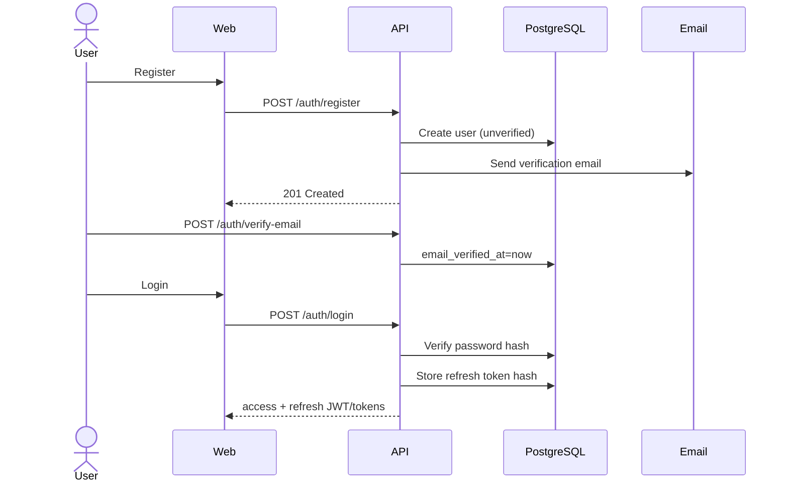
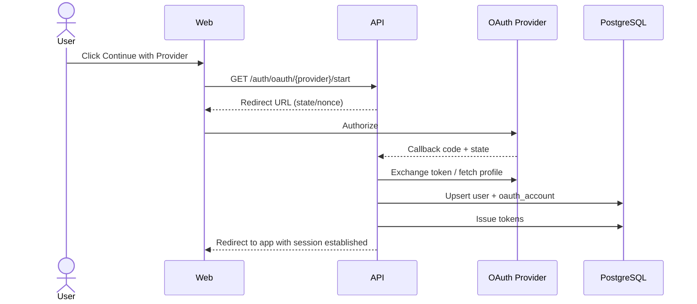

# 12. Auth, RAG Pipeline & Integration Architecture

| Field | Value |
|-------|--------|
| Document ID | EAW-FLOW-001 |
| Version | 1.0.0 |

---

## 12.1 Authentication Flow

### 12.1.1 Email / Password



### 12.1.2 Token Lifecycle

| Token | Lifetime (default) | Storage |
|-------|--------------------|---------|
| Access JWT | 15 minutes | Memory / auth header |
| Refresh | 7–30 days | HttpOnly cookie preferred; or secure client storage with threat model documented |
| Refresh at rest (server) | Until expiry/revoke | SHA-256 hash only |

**Refresh rotation:** each refresh issues new refresh token and revokes previous (reuse detection optional P1).

### 12.1.3 OAuth (Google / GitHub)



### 12.1.4 Password Reset

1. `POST /auth/password/forgot` always returns generic success  
2. Email contains one-time token (hash stored, short TTL)  
3. `POST /auth/password/reset` validates token, sets new password, revokes refresh tokens  

### 12.1.5 Request Authorization

```
Bearer access token
  → load user
  → resolve X-Organization-Id membership
  → evaluate role + department policy
  → proceed or 403
```

---

## 12.2 RBAC + Department Model

```
Permission = RoleDefaults ∩ ResourceACL ∩ DepartmentScope
```

| Role | Scope intuition |
|------|-----------------|
| Owner | Entire workspace |
| Admin | Workspace ops except ownership transfer/billing destroy constraints |
| Manager | Department-scoped management + analytics |
| Employee | Contribute + consume allowed knowledge |
| Guest | Read/chat limited sources only |

---

## 12.3 RAG Pipeline Architecture (Detailed)

### 12.3.1 Indexing Path

| Stage | Responsibility | Failure behavior |
|-------|----------------|------------------|
| 1. Upload/Sync | Persist bytes + DB row | Reject invalid files |
| 2. Extraction | PDF/DOCX/PPTX/CSV/MD/TXT loaders (LlamaIndex/LangChain readers) | fail job |
| 3. Cleaning | Normalize whitespace, strip junk, optional PII redaction hooks | continue with metrics |
| 4. OCR | If text density low / scanned PDF | optional stage; costlier |
| 5. Chunking | Size/overlap; heading-aware where possible | fail if empty |
| 6. Embedding | Provider port (OpenAI / ST / etc.) | retry |
| 7. Qdrant upsert | Vectors + payload ACL fields | retry |
| 8. Finalize | status=ready; chunk_count; model version | |

### 12.3.2 Query Path

| Stage | Responsibility |
|-------|----------------|
| 1. Guardrails | AuthZ, rate limit, max input length |
| 2. Query prep | Rewrite optional; embed query; keywords |
| 3. Hybrid retrieve | Dense + sparse/keyword + metadata filters |
| 4. Re-rank | Cross-encoder scores |
| 5. Compress | Drop redundant spans; keep evidence |
| 6. Grounding check | Threshold on scores/coverage |
| 7. Generate | Prompt: answer only from context; cite |
| 8. Post | Confidence, citations, suggestions, usage |

### 12.3.3 Anti-Hallucination Controls

1. System prompt forbids inventing sources  
2. Hard refuse when top scores & coverage below thresholds  
3. Citations mandatory for grounded mode  
4. Confidence score derived from retrieval/rerank signals (+ optional model self-check later)  
5. Evaluation set of golden Q&A in later test phase  

### 12.3.4 Prompt Template (Logical)

```
SYSTEM: You are an enterprise assistant. Use ONLY provided context.
If context is insufficient, say you don't have enough information.
Cite sources using [n] markers matching the context list.

CONTEXT:
[1] (title, loc) ...
[2] ...

MEMORY SUMMARY: ...
USER: ...
```

### 12.3.5 Memory Strategy

| Type | Mechanism |
|------|-----------|
| Short-term | Last N turns in prompt |
| Long-term (conversation) | `memory_summary` periodically updated by worker/LLM |
| Workspace memory | Deferred (P2) |

---

## 12.4 Provider Abstraction

```text
LLMPort.chat(messages, stream, tools?)
EmbeddingPort.embed(texts) -> vectors
RerankPort.rerank(query, passages) -> ranked
OCRPort.extract(file) -> text
```

**Factory** selects implementation from env:

- `LLM_PROVIDER=openai|grok|gemini|openrouter`  
- `EMBEDDING_PROVIDER=openai|sentence_transformers`  

Application services never import vendor SDKs directly.

---

## 12.5 Integration Architecture

### 12.5.1 Shared Connector Contract

```text
ConnectorPort
  connect(auth) -> Connector
  list_resources() -> Resource[]
  select_resources(ids)
  sync(full|incremental) -> SyncJob
  map_to_documents(items) -> NormalizedDocument[]
```

Normalized documents enter the **same ingestion pipeline** as uploads, with `source_type` set.

### 12.5.2 GitHub Intelligence (beyond index)

| Capability | Pattern |
|------------|---------|
| Repo chat | Indexed code/docs + optional live file fetch |
| Architecture explain | Structured repo summary + RAG |
| PR review | Fetch PR diff via API + LLM review rubric |
| Generate docs/tests | Code context + generation templates |
| Explain function | Symbol-oriented retrieval |

### 12.5.3 Notion / Drive

- OAuth + selected pages/folders  
- Incremental sync via cursors/webhooks where available  
- Reindex on change  

### 12.5.4 Slack / Jira

- Channel/project selection  
- Summaries as generation tasks over fetched/indexed windows  
- Issue search: hybrid of API JQL/search + indexed comments  

### 12.5.5 Security for Connectors

- Store tokens encrypted or in secret manager reference  
- Least-privilege OAuth scopes  
- Audit connect/disconnect/sync  
- Per-org connector enablement  

---

## 12.6 Security Controls Map

| Control | Implementation intent |
|---------|----------------------|
| HTTPS | Nginx TLS |
| Rate limit | API middleware + Redis counters |
| Audit logs | `audit_logs` table |
| Secure headers | Nginx |
| SQLi | SQLAlchemy bound params |
| XSS | React escaping + CSP |
| CSRF | Token/same-site for cookie flows |
| File validation | MIME sniff + allow-list + size |
| Virus scan | `VirusScanPort` no-op/placeholder adapter |

---

**Next:** [13-DEPLOYMENT-ARCHITECTURE.md](./13-DEPLOYMENT-ARCHITECTURE.md)
