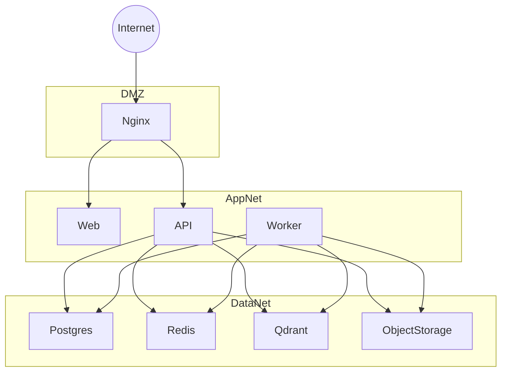
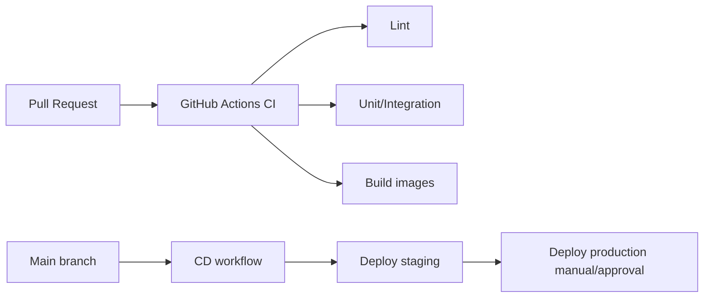

# 13. Deployment Architecture

| Field | Value |
|-------|--------|
| Document ID | EAW-DEP-001 |
| Version | 1.0.0 |

---

## 13.1 Goals

- Production-like local development  
- Simple path from Compose → hardened Compose/Nginx  
- CI on every PR; CD prepared in Phase 10  
- Secrets only via environment  

---

## 13.2 Environments

| Env | Purpose |
|-----|---------|
| local | Full Docker Compose; hot reload optional |
| staging | Prod-like images, separate secrets |
| production | TLS, backups, resource limits, monitoring hooks |

---

## 13.3 Compose Services (Target)

| Service | Image/Role |
|---------|------------|
| `web` | Next.js |
| `api` | FastAPI uvicorn/gunicorn |
| `worker` | Celery worker |
| `beat` | Celery beat (optional schedules) |
| `postgres` | PostgreSQL 16 |
| `redis` | Redis 7 |
| `qdrant` | Qdrant |
| `nginx` | Reverse proxy (prod profile) |
| `minio` (optional local) | S3-compatible storage |

---

## 13.4 Network Topology

**Principle:** Data services not published publicly in production.

---

## 13.5 Nginx Responsibilities

- TLS termination  
- Route `/` → web  
- Route `/api` → api  
- Security headers  
- Optional basic rate limiting  
- Max body size for uploads  
- WebSocket/SSE timeouts for streaming  

---

## 13.6 Configuration

| Variable group | Examples |
|----------------|----------|
| App | `APP_ENV`, `LOG_LEVEL`, `CORS_ORIGINS` |
| Auth | `JWT_SECRET`, `ACCESS_TOKEN_TTL`, `REFRESH_TOKEN_TTL` |
| OAuth | `GOOGLE_CLIENT_ID/SECRET`, `GITHUB_CLIENT_ID/SECRET` |
| DB | `DATABASE_URL` |
| Redis | `REDIS_URL` |
| Qdrant | `QDRANT_URL`, `QDRANT_API_KEY` |
| Storage | `S3_ENDPOINT`, `S3_BUCKET`, `S3_ACCESS_KEY`, `S3_SECRET_KEY` |
| LLM | `LLM_PROVIDER`, `OPENAI_API_KEY`, model names |
| Embeddings | `EMBEDDING_PROVIDER`, `EMBEDDING_MODEL` |
| Limits | `MAX_UPLOAD_MB`, `RATE_LIMIT_CHAT` |

`.env.example` documents all keys; real `.env` never committed.

---

## 13.7 CI/CD (Phase 10 Complete)

CI checks:

- Backend: Ruff/pytest  
- Frontend: ESLint/tsc/vitest or jest  
- Docker build smoke  

---

## 13.8 Observability Ops Baseline

| Signal | Approach |
|--------|----------|
| Logs | stdout JSON → container log driver |
| Health | `/health`, `/ready` |
| Metrics | usage tables + future Prometheus hooks |
| Backups | PostgreSQL scheduled dumps; S3 versioning |
| Migrations | Alembic on deploy job |

---

## 13.9 Scaling Strategy

| Bottleneck | Scale action |
|------------|--------------|
| Chat concurrency | Scale API replicas |
| Indexing backlog | Scale Celery workers |
| Vector search | Qdrant resources / sharding later |
| DB | Vertical + read replicas later |
| Storage | S3 durability |

---

## 13.10 Security Deployment Checklist

- [ ] TLS certificates  
- [ ] Strong `JWT_SECRET`  
- [ ] Private networks for data tier  
- [ ] Non-root containers  
- [ ] Resource limits  
- [ ] Upload size limits  
- [ ] CORS locked to known origins  
- [ ] Dependency scanning in CI  

---

**Next:** [14-TECH-STACK-JUSTIFICATION.md](./14-TECH-STACK-JUSTIFICATION.md)
