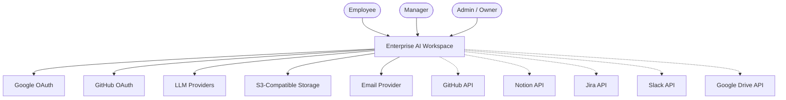
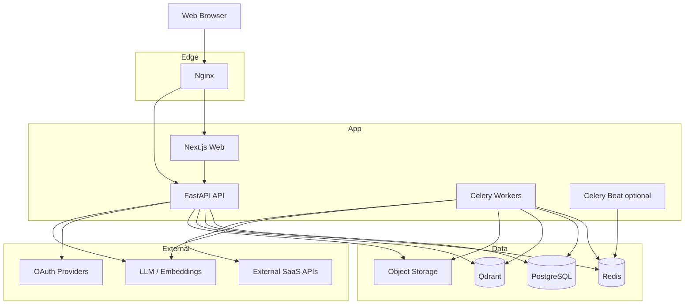
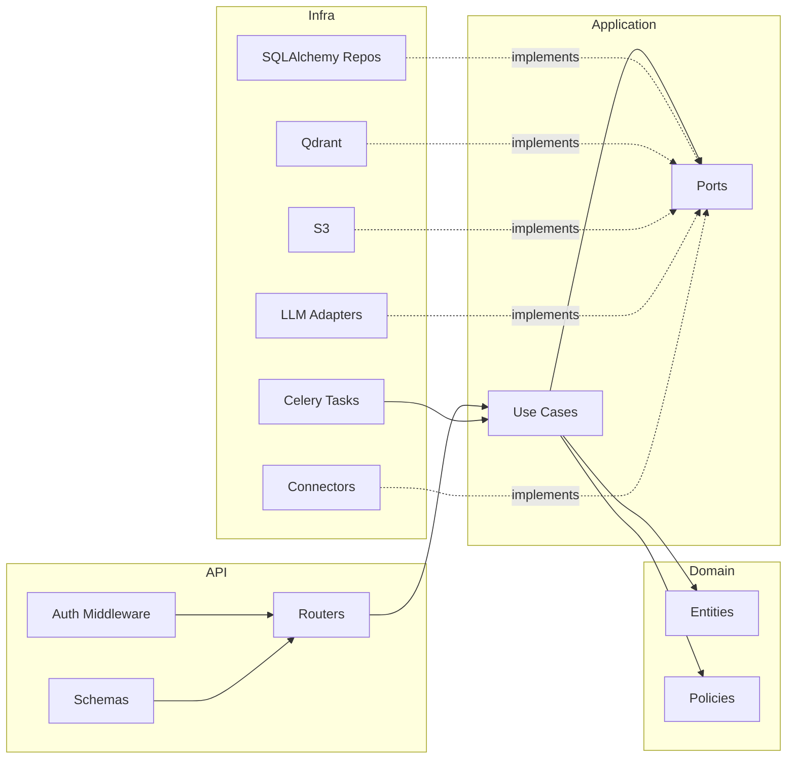
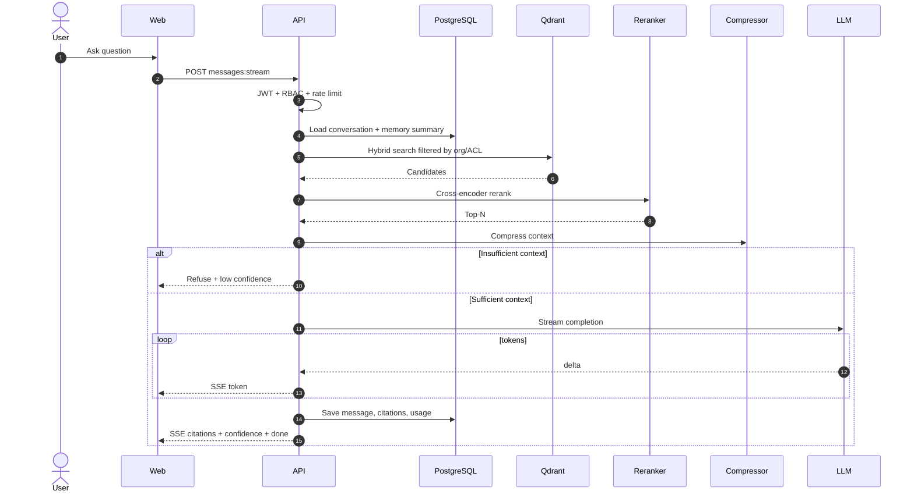
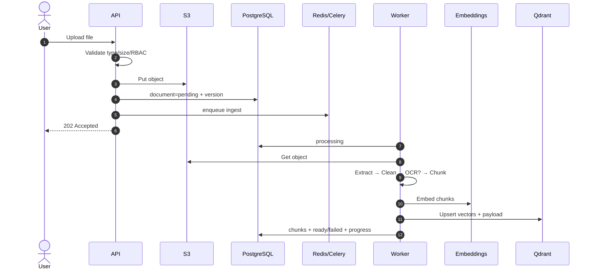
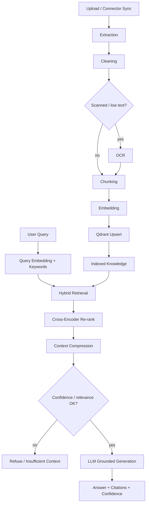
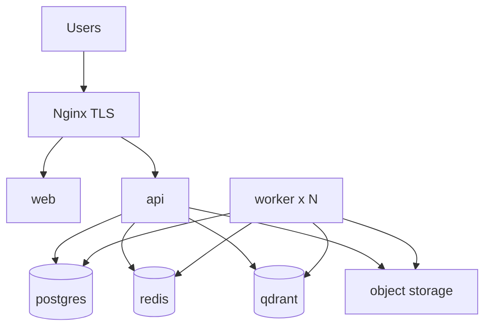

# 6. Architecture Diagrams (Mermaid)

| Field | Value |
|-------|--------|
| Document ID | EAW-DIAG-001 |
| Version | 1.0.0 |

---

## 6.1 System Context

---

## 6.2 Container Architecture

---

## 6.3 Clean Architecture (Backend)

---

## 6.4 Sequence — Grounded Chat (SSE)

---

## 6.5 Sequence — Document Ingestion

---

## 6.6 RAG Pipeline Architecture

---

## 6.7 Deployment Nodes

---

**Next:** [07-USE-CASE-DIAGRAM.md](./07-USE-CASE-DIAGRAM.md)
