# 7. Use Case Diagram

| Field | Value |
|-------|--------|
| Document ID | EAW-UC-001 |
| Version | 1.0.0 |

---

## 7.1 Primary Use Case Diagram

```mermaid
flowchart TB
  Guest([Guest])
  Employee([Employee])
  Manager([Manager])
  Admin([Admin])
  Owner([Owner])
  Worker([Celery Worker])

  subgraph System["Enterprise AI Workspace"]
    subgraph Identity
      UC_Reg([Register / Verify Email])
      UC_Login([Login / OAuth])
      UC_Reset([Password Reset])
      UC_Logout([Logout / Refresh])
    end

    subgraph Workspace
      UC_CreateWS([Create Workspace])
      UC_Invite([Invite Members])
      UC_Roles([Manage Roles])
      UC_Dept([Manage Departments])
      UC_Settings([Workspace Settings])
    end

    subgraph Knowledge
      UC_KB([Manage Knowledge Bases])
      UC_Upload([Upload Documents])
      UC_Version([Version Documents])
      UC_SearchDoc([Search Documents])
      UC_Preview([Preview Metadata])
    end

    subgraph AI
      UC_Chat([Enterprise Chat])
      UC_Cite([View Citations])
      UC_Suggest([Suggested Questions])
      UC_Summary([AI Summaries / Tags])
    end

    subgraph Connectors
      UC_GH([GitHub Intelligence])
      UC_Notion([Notion Sync])
      UC_Drive([Drive Sync])
      UC_Slack([Slack AI])
      UC_Jira([Jira AI])
    end

    subgraph Gov
      UC_Analytics([View Analytics])
      UC_Audit([View Audit Logs])
    end

    subgraph Pipeline
      UC_Ingest([Ingest / Index Pipeline])
    end
  end

  Guest --> UC_Reg
  Guest --> UC_Login
  Guest --> UC_Reset

  Employee --> UC_Login
  Employee --> UC_Upload
  Employee --> UC_SearchDoc
  Employee --> UC_Chat
  Employee --> UC_Cite
  Employee --> UC_Suggest
  Employee --> UC_Logout

  Manager --> Employee
  Manager --> UC_Dept
  Manager --> UC_Summary
  Manager --> UC_Analytics

  Admin --> Manager
  Admin --> UC_Invite
  Admin --> UC_Roles
  Admin --> UC_KB
  Admin --> UC_Version
  Admin --> UC_Settings
  Admin --> UC_Audit
  Admin --> UC_GH
  Admin --> UC_Notion
  Admin --> UC_Drive
  Admin --> UC_Slack
  Admin --> UC_Jira

  Owner --> Admin
  Owner --> UC_CreateWS

  Worker --> UC_Ingest
  UC_Upload --> UC_Ingest
  UC_GH --> UC_Ingest
  UC_Notion --> UC_Ingest
  UC_Drive --> UC_Ingest
```

---

## 7.2 Actor × Use Case Matrix

| Use Case | Guest | Employee | Manager | Admin | Owner | Worker |
|----------|:-----:|:--------:|:-------:|:-----:|:-----:|:------:|
| Register/Login/OAuth/Reset | ✓ | ✓ | ✓ | ✓ | ✓ | |
| Create workspace | | ✓ | ✓ | ✓ | ✓ | |
| Invite / roles | | | | ✓ | ✓ | |
| Departments | | | limited | ✓ | ✓ | |
| Upload docs | | ✓ | ✓ | ✓ | ✓ | |
| Chat + citations | limited | ✓ | ✓ | ✓ | ✓ | |
| Analytics | | | limited | ✓ | ✓ | |
| Audit logs | | | | ✓ | ✓ | |
| Connectors admin | | | | ✓ | ✓ | |
| Ingestion pipeline | | | | | | ✓ |

---

## 7.3 Critical Narratives

### UC — Enterprise Chat (Happy Path)
1. Employee opens allowed knowledge scope.  
2. Asks question.  
3. System retrieves, reranks, compresses.  
4. If sufficient: streams grounded answer + citations + confidence.  
5. If insufficient: refuses fabrication.  

### UC — Upload Document
1. Employee uploads allowed file type.  
2. API stores object, creates pending version.  
3. Worker runs full pipeline.  
4. Document becomes ready for retrieval.  

### UC — Invite Member
1. Admin invites email + role (+ department).  
2. Invitee accepts.  
3. Membership active; audit logged.  

---

**Next:** [../architecture/08-DATABASE-SCHEMA.md](../architecture/08-DATABASE-SCHEMA.md)
