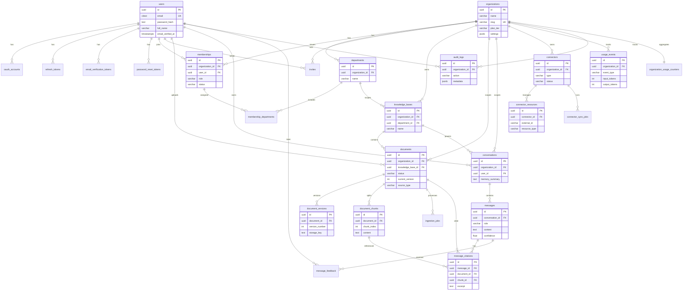
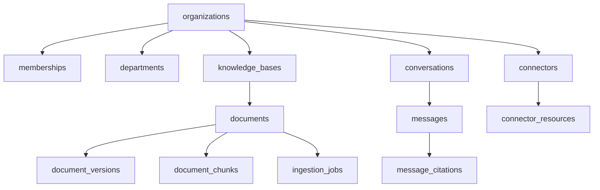

# 9. ER Diagram

| Field | Value |
|-------|--------|
| Document ID | EAW-ER-001 |
| Version | 1.0.0 |

---

## 9.1 Entity Relationship Diagram

---

## 9.2 Tenant Isolation View

**Invariant:** Every read/write path for tenant data validates membership and applies `organization_id` predicates.

---

**Next:** [../architecture/10-API-DESIGN.md](../architecture/10-API-DESIGN.md)
