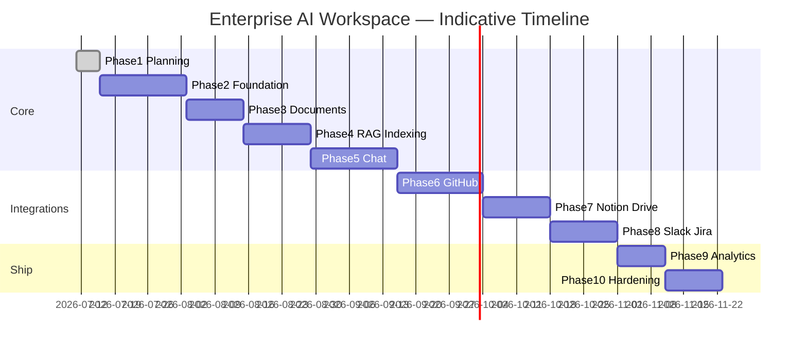

# 15. Roadmap, Timeline, Priorities & Future Enhancements

| Field | Value |
|-------|--------|
| Document ID | EAW-RM-001 |
| Version | 1.0.0 |

---

## 15.1 Development Roadmap

| Phase | Name | Outcome |
|-------|------|---------|
| **1** | Planning | SRS, requirements, architecture, schema, API, roadmap (**this phase**) |
| **2** | Foundation | Repo setup, Docker, Postgres, Auth, RBAC, Orgs, Departments, workspace mgmt |
| **3** | Document Management | Upload, preview, metadata, search, versioning, S3 storage |
| **4** | RAG Indexing | Chunking, embeddings, Qdrant, Celery workers, progress tracking, OCR hook |
| **5** | Enterprise AI Chat | Streaming, citations, memory, hybrid retrieval, compression, confidence, prompts |
| **6** | GitHub Intelligence | Connect, index repos, repo chat, PR review, docs/tests generation |
| **7** | Notion + Google Drive | Import/sync, automatic indexing |
| **8** | Slack + Jira | Summaries, search, sprint/story intelligence |
| **9** | Admin & Analytics | Dashboards, monitoring views, department activity, storage |
| **10** | Hardening & Ship | Tests, CI/CD, Docker optimization, Nginx prod, documentation |

---

## 15.2 Milestones

| Milestone | Exit Criteria |
|-----------|---------------|
| **M0 — Blueprint** | Phase 1 docs approved; no code required |
| **M1 — Secure Tenant Core** | Users auth; create workspace; invite; RBAC enforced; Compose up |
| **M2 — Knowledge Store** | Upload supported types; versions; metadata; S3; list/search |
| **M3 — Indexed Corpus** | Async pipeline; Qdrant populated; progress + failure states |
| **M4 — Grounded Chat** | Stream answers; citations; refuse path; confidence; history |
| **M5 — Engineering Copilot** | GitHub connected; repo chat + PR assist |
| **M6 — Knowledge Graph of Work** | Notion + Drive sync live |
| **M7 — Team Collaboration AI** | Slack + Jira features usable |
| **M8 — Command Center** | Analytics + audit polished |
| **M9 — Production Ready** | CI green; deploy docs; security checklist signed |

---

## 15.3 Estimated Timeline

Assumes **1 full-stack senior engineer** (adjust ×0.6 with pair; ×1.5–2 with design/devops split overhead).

| Phase | Duration (calendar) | Cumulative |
|-------|---------------------|------------|
| 1 Planning | 3–5 days | Week 1 |
| 2 Foundation | 2–3 weeks | Week 3–4 |
| 3 Documents | 1.5–2 weeks | Week 5–6 |
| 4 RAG Indexing | 2 weeks | Week 7–8 |
| 5 Enterprise Chat | 2–3 weeks | Week 9–11 |
| 6 GitHub | 2–3 weeks | Week 12–14 |
| 7 Notion + Drive | 2 weeks | Week 14–16 |
| 8 Slack + Jira | 2 weeks | Week 16–18 |
| 9 Analytics | 1–1.5 weeks | Week 18–19 |
| 10 Hardening | 1.5–2 weeks | **~Week 20–21** |

**Indicative total:** ~4.5–5.5 months to full vision modules.  
**MVP production path (Phases 2–5 only):** ~2.5–3 months.

---

## 15.4 Feature Priority

### P0 — Core Product (must)

- Multi-tenant workspaces  
- Auth (local + OAuth + verify + reset + JWT refresh)  
- RBAC roles (5) + invites  
- Departments (basic model)  
- Document upload (6 types) + async index + Qdrant  
- Hybrid retrieve + rerank + compression  
- Streaming chat + citations + confidence + refuse  
- Audit logs + rate limits + Docker Compose  

### P1 — Strong v1.x

- Document versioning UX polish, preview, search  
- OCR for scanned PDFs  
- AI tags/summaries  
- Conversation memory + suggestions + feedback  
- Department-scoped ACLs  
- Analytics dashboards  
- Virus scan placeholder  
- CI pipeline  

### P2 — Expansion Modules

- GitHub intelligence suite  
- Notion, Drive, Slack, Jira  
- OneDrive, SharePoint, Email  
- Voice queries  
- Multi-KB/multi-source chat advanced routing  
- Billing provider integration (Stripe etc.)  

---

## 15.5 MoSCoW (MVP = Phases 2–5)

| Must | Should | Could | Won’t (yet) |
|------|--------|-------|-------------|
| Auth, RBAC, Orgs | OCR | Voice | Air-gapped training |
| Docs upload + index | Memory + suggestions | Multi-region HA | Native mobile |
| Grounded streaming chat | Analytics v1 | Advanced agent tools | Full SOC2 program |
| Citations + refuse | Dept ACL | Connector pack | Plugin marketplace |

---

## 15.6 Future Enhancements

1. **Voice queries** and meeting audio ingestion  
2. **OneDrive / SharePoint / Email** connectors  
3. **Agentic workflows** (multi-step tools with approval)  
4. **Customer-managed keys (CMK)** and private LLM endpoints  
5. **SSO/SAML/OIDC enterprise IdP**  
6. **Row-level attribute policies (ABAC)** beyond departments  
7. **Evaluation harness** (ragas/offline quality gates in CI)  
8. **Semantic cache** for repeated questions  
9. **Billing & metering** with Stripe/marketplace  
10. **Mobile clients** and Slack-native bot surface  
11. **Multi-region residency** controls  
12. **GraphRAG** / knowledge graph enrichment  

---

## 15.7 Phase 1 Exit Checklist

- [x] SRS  
- [x] Functional requirements  
- [x] Non-functional requirements  
- [x] User stories  
- [x] System architecture  
- [x] Mermaid architecture diagrams  
- [x] Use case diagram  
- [x] Database schema  
- [x] ER diagram  
- [x] API design  
- [x] Folder structure  
- [x] Auth / RAG / integrations architecture  
- [x] Deployment architecture  
- [x] Tech stack justification  
- [x] Roadmap, milestones, timeline, priorities, future  

**No application code written.**

---

## 15.8 Stop Gate

**Phase 1 is complete.**

Do not start Phase 2 until the user explicitly says:

> **NEXT PHASE**

Phase 2 will implement: project setup, Docker, PostgreSQL, authentication, RBAC, organizations/workspaces, and department foundations — production-quality only.
